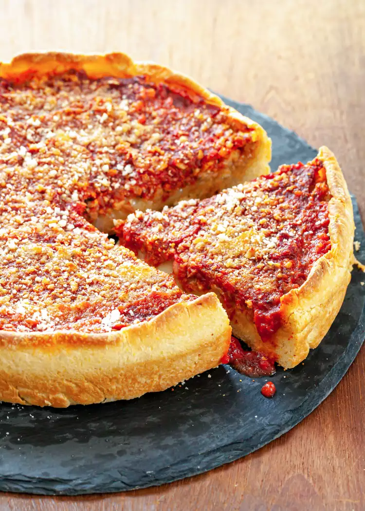

# Receitas de Pizzas

Bem-vindo à seção Receitas de Pizza do nosso repositório! 🍕🍴

Nesta seção, convidamos você a explorar uma variedade de deliciosas receitas de pizza compartilhadas por outros entusiastas de pizza. Dos favoritos clássicos às criações inovadoras, você encontrará inspiração para criar sua pizza caseira perfeita. Pegue seu avental, pré-aqueça o forno e vamos cozinhar!

## Pizzas

- [Margherita](#Margherita)
- [Pepperoni](#Pepperoni)
- [4 Queijos🧀](#4-Queijos)
- [Linguiça Blumenau](#Linguiça Blumenau)
- [Frango com Catupiry](#Frango-com-Catupiry)
- [Deep Pizza](https://github.com/AbuSpace/pizza/issues/25)

# Margherita

# Ingredientes

- 1 Bola de Pizza
- Molho de Tomate
- Mussarela
- Manjericão
- Tomates
- Azeite
- Temperos a Gosto

# Passo a Passo

1. Abrir massa de pizza
2. Colocar Molho de Tomate
3. Colocar Mussarela
4. Colocar Tomates
5. Colocar Folhas de Manjericão
6. Colocar um fio de Azeite
7. Temperar a Gosto
8. Assar até a cor da massa ficar a gosto
9. Fatiar
10. Comer :-)

# Pepperoni

- Foto
- Ingredientes
- Passo a Passo

# 4 Queijos

- Foto
- Ingredientes
- Passo a Passo

### Linguiça Blumenau

## Ingredientes

- 1 Bola de Pizza
- Molho de Tomate
- Mussarela
- Manjericão
- Linguiça Blumenau

## Passo a Passo

1. Abrir massa de pizza
2. Colocar Molho de Tomate
3. Colocar Mussarela
4. Colocar fatias de Linguiça Blumenau
5. Assar até a cor da massa ficar a gosto
6. Fatiar
7. Comer :-)

# Deep Pizza

### Preparação da Massa
- Misturar farinha, água, sal e fermento.
- Sovar a massa até ficar macia e elástica.
- Deixar a massa descansar e crescer.

### Preparação do Molho de Tomate
- Triturar tomates frescos.
- Refogar os tomates com alho e temperos.
- Deixar o molho apurar.

### Preparação dos Ingredientes
- Cortar os vegetais (pimentão, cebola, cogumelos).
- Fatiar os ingredientes de carne (pepperoni, linguiça).
- Preparar outros ingredientes desejados (azeitonas, pimentas).

### Montagem da Pizza
- Esticar a massa e colocá-la na forma de pizza profunda.
- Espalhar o molho de tomate sobre a massa.
- Adicionar queijo.
- Adicionar os ingredientes preparados.

### Assar a Pizza
- Pré-aquecer o forno.
- Colocar a pizza no forno e assar até dourar.
- Retirar a pizza do forno e deixar esfriar um pouco antes de servir.

### Servir e Desfrutar da Deep Pizza!

### Frango com Catupiry

- Foto
- Ingredientes
- Passo a Passo
